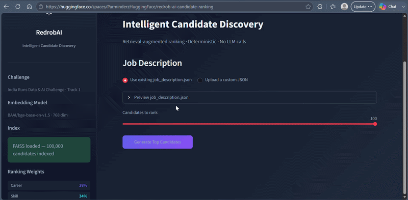

# RedrobAI — India Runs Intelligent Candidate Discovery System

[](https://www.python.org/)
[](https://huggingface.co/spaces/ParminderzHuggingFace/redrob-ai-candidate-ranking)
[](./LICENSE)
[](https://hack2skill.com/event/india_runs/)
[](https://faiss.ai)

## 🚀 Live Demo

Hugging Face Space:

[Redrob AI Candidate Ranking Demo](https://huggingface.co/spaces/ParminderzHuggingFace/redrob-ai-candidate-ranking)

---

AI-powered candidate discovery system built for the Redrob AI India Runs Data & AI Challenge (Track 1).

The pipeline uses semantic retrieval via a FAISS vector index to pull candidate profiles matching a job description. Retrieved profiles are then evaluated using a hybrid deterministic scoring mechanism that weighs career relevance, skill matches, behavioral signals, profile consistency, and semantic similarity. Finally, the system automatically generates structured recruiter-ready explanations justifying each ranking.

---

## Demo

> **Run locally:** `streamlit run app.py`

### Demo Preview



The Streamlit app provides:
- Upload a custom job description JSON **or** use the bundled challenge JD
- One-click **Generate Top Candidates** (uses cached FAISS — no rebuild)
- Sortable ranked table with scores, titles, experience, industry, reasoning
- Plotly charts: score distribution, component averages, top industries, experience spread
- Per-candidate score breakdown with matched/missing evidence tags
- Download: `submission.csv` · `submission.xlsx` · `ranking.json` · `pipeline_report.json`
- Live deployment on Hugging Face Spaces

---

## Results

| Metric | Value |
|---|---|
| Candidates in index | 100,000 |
| Candidates ranked | 100 |
| Top score | 0.8759 |
| Score range | 0.4266 – 0.8759 |
| Retrieval time | 1.8 s |
| Hybrid scoring time | 18 s |
| Total runtime | **~20 s** |
| Unique explanations | 100 / 100 |
| Submission validation | **PASS** (23/23 checks) |
| Pipeline validator | **PASS** (23/23 checks) |

**Ranking Strategy**

FAISS semantic retrieval → Hybrid scoring → Deterministic explanation generation.

---

## Table of Contents

1. [Architecture](#architecture)
2. [Repository Layout](#repository-layout)
3. [Notebooks](#notebooks)
4. [Pipeline Overview](#pipeline-overview)
5. [Offline Indexing (one-time setup)](#offline-indexing-one-time-setup)
6. [Running the Ranking](#running-the-ranking)
7. [Generating the Submission](#generating-the-submission)
8. [Streamlit Demo](#demo)
9. [Artifacts](#artifacts)
10. [Performance](#performance)
11. [Limitations](#limitations)
12. [Future Work](#future-work)

---

## Architecture

> See full Mermaid diagrams in [`docs/architecture.md`](docs/architecture.md) and [`docs/pipeline_flow.md`](docs/pipeline_flow.md).

```
┌─────────────────────────────────────────────────────────────────────────┐
│                        OFFLINE (one-time)                               │
│                                                                         │
│  candidates.jsonl ──► CandidateParser ──► RetrievalDocumentBuilder      │
│                                                  │                      │
│                                         EmbeddingEngine (BGE-Base)      │
│                                                  │                      │
│                                          FAISS IndexFlatIP              │
│                                                  │                      │
│                           artifacts/faiss/{faiss.index,                 │
│                                           candidate_lookup.pkl,          │
│                                           embedding_metadata.pkl}        │
└─────────────────────────────────────────────────────────────────────────┘

┌─────────────────────────────────────────────────────────────────────────┐
│                        ONLINE (per job)                                 │
│                                                                         │
│  job_description.json ──► JobDescriptionParser ──► ParsedJob            │
│                                                          │              │
│                                              FAISS top-K retrieval      │
│                                                          │              │
│                                           HybridRanker (weighted sum)   │
│                                    ┌──────────────────────────────┐     │
│                                    │  CareerScorer   (38%)         │     │
│                                    │  SkillScorer    (34%)         │     │
│                                    │  SemanticScore  (18%)         │     │
│                                    │  BehaviorScorer  (5%)         │     │
│                                    │  ConsistencyScorer (5%)       │     │
│                                    └──────────────────────────────┘     │
│                                                          │              │
│                                         SubmissionGenerator             │
│                                    ┌──────────────────────────────┐     │
│                                    │  submission.csv               │     │
│                                    │  ranking.json                 │     │
│                                    │  pipeline_report.json         │     │
│                                    └──────────────────────────────┘     │
└─────────────────────────────────────────────────────────────────────────┘
```

### Scorer Weights

| Scorer | Weight | Signal |
|---|---|---|
| Career | 38% | Role title relevance, progression, industry, responsibilities |
| Skill | 34% | Required/preferred skill match, proficiency, duration, endorsements |
| Semantic | 18% | FAISS cosine similarity (BGE-Base-EN-v1.5) |
| Behavior | 5% | Open-to-work, verified contact, response rate, notice period |
| Consistency | 5% | Profile data quality and internal consistency |
| Education | 0% | Present in schema; disabled for this challenge job |

---

## Repository Layout

```
India-Runs/
├── rank.py                     # ← Official ranking entry point (use this)
├── run_pipeline.py             # Full integration test and smoke test
├── job_description.json        # Challenge job description
├── submission_metadata.yaml    # Submission metadata (team, compute, methodology)
├── requirements.txt
│
├── src/
│   ├── config.py               # All tunable constants (weights, paths, thresholds)
│   ├── parser/
│   │   ├── candidate_parser.py
│   │   └── job_description_parser.py
│   ├── embeddings/
│   │   └── embedder.py         # BGE-Base embedding engine
│   ├── retrieval/
│   │   ├── retriever.py        # FAISS load/search
│   │   └── document_builder.py
│   ├── scoring/
│   │   ├── hybrid_ranker.py    # Orchestrates all scorers
│   │   ├── career_scorer.py
│   │   ├── skill_scorer.py
│   │   ├── behavior_scorer.py
│   │   └── consistency_scorer.py
│   ├── submission/
│   │   ├── submission_generator.py
│   │   ├── submission_validator.py  # Row/CSV validation
│   │   └── reason_generator.py      # Recruiter explanation templates
│   ├── pipeline/
│   │   ├── offline_pipeline.py      # One-time embedding + FAISS build
│   │   └── pipeline_validator.py    # Artifact health checks
│   ├── models/                 # Typed dataclasses (Candidate, ParsedJob, etc.)
│   └── utils/
│       ├── logging.py          # setup_logging, stage_log context manager
│       ├── exceptions.py
│       └── file_utils.py
│
├── artifacts/
│   ├── faiss/
│   │   ├── faiss.index             # ← pre-built; do NOT delete
│   │   ├── candidate_lookup.pkl    # ← pre-built; do NOT delete
│   │   └── embedding_metadata.pkl  # ← pre-built; do NOT delete
│   └── embeddings/
│
├── outputs/                    # Generated on each run (not committed)
│   ├── submission.csv
│   ├── ranking.json
│   └── pipeline_report.json
│
├── notebooks/
│   ├── notebook-1-dataset-forensics-problem-understand.ipynb
│   └── notebook-2-offline-index-builder.ipynb
│
└── tests/
    └── test_ranking_intelligence.py
```

---

## Notebooks

The complete experimentation workflow is available on Kaggle for reproducibility.

### Kaggle Notebooks

- ### Kaggle Notebooks

- **[Notebook 1 — Dataset Forensics & Problem Understanding](https://www.kaggle.com/code/parmindersingh2002/notebook-1-dataset-forensics-problem-understand)**

- **[Notebook 2 — Offline Index Builder (Embeddings + FAISS Generation](https://www.kaggle.com/code/parmindersingh2002/notebook-2-offline-index-builder)**

### Original Challenge Dataset

- **[Redrob AI India Runs Data & AI Challenge Dataset](https://www.kaggle.com/datasets/parmindersingh2002/redrob-ai-india-runs-hackathon-dataset)**

---

## Pipeline Overview

```
job_description.json
       │
       ▼
 JobDescriptionParser
       │  ParsedJob (job_id, title, required_skills, SearchQuery, CandidateFilters)
       ▼
 FAISS retrieval  ──────────── artifacts/faiss/faiss.index
       │  top-100 candidate IDs + cosine similarity scores
       ▼
 CandidateResolver  ─────────── candidates.jsonl
       │  Candidate objects (parsed on first use, then cached)
       ▼
 HybridRanker
       │  per-candidate: CareerScorer + SkillScorer + BehaviorScorer +
       │                 ConsistencyScorer + semantic score → weighted sum
       │  calibration adjustment (±0.08) based on joint technical evidence
       │  sorted descending by weighted_final_score
       ▼
 SubmissionGenerator
       │  builds SubmissionRow list (candidate_id, rank, score, reasoning)
       │  validates via SubmissionValidator
       │  writes submission.csv + ranking.json + pipeline_report.json
       ▼
 Outputs:
   outputs/submission.csv          — official submission
   outputs/ranking.json            — full scoring breakdown
   outputs/pipeline_report.json    — timing, weights, top-10
```

---

## Offline Indexing (one-time setup)

> ⚠️ **Skip this step if `artifacts/faiss/faiss.index` already exists.**
> The pipeline detects the artifacts and skips rebuilding automatically.

The FAISS index is built once from `candidates.jsonl` using the
`BAAI/bge-base-en-v1.5` sentence-transformer model.

```bash
# Only run this if artifacts are missing or corrupted:
python run_pipeline.py --rebuild-index
```

What this does:
1. Loads and parses all candidates from `candidates.jsonl`
2. Generates 768-dimensional BGE-Base embeddings for each candidate
3. Builds a `faiss.IndexFlatIP` (inner-product) index over L2-normalised vectors
4. Persists the index, a candidate ID lookup dict, and embedding metadata to `artifacts/faiss/`

**Estimated time:** ~15–40 minutes depending on CPU (no GPU required).

---

## Deployment

### Automated Artifact Delivery

The application automatically downloads the required artifacts—including the FAISS index, candidate lookup, embedding metadata, and candidates.jsonl—using the built-in `ArtifactManager`.

These files are retrieved directly from the following Hugging Face datasets:
- **FAISS Index & Metadata**: [ParminderzHuggingFace/india-runs-faiss-artifacts](https://huggingface.co/datasets/ParminderzHuggingFace/india-runs-faiss-artifacts)

- **Candidate Dataset**: [ParminderzHuggingFace/india-runs-candidates](https://huggingface.co/datasets/ParminderzHuggingFace/india-runs-candidates)

No manual downloads or configuration are required to set up the runtime data.

---

## Running the Ranking

Ensure you are using the project virtual environment:

```bash
# Windows
.venv\Scripts\activate

# macOS / Linux
source .venv/bin/activate
```

Install dependencies (first time only):

```bash
pip install -r requirements.txt
```

Run the full pipeline validation and smoke test:

```bash
python run_pipeline.py
```

This will:
- Verify project structure
- Test all scorers with sample candidates
- Load existing FAISS artifacts (no rebuild)
- Produce ranked results and generate submission artifacts

---

## Generating the Submission

Use `rank.py` (the official entry point) to generate the final submission:

```bash
python rank.py \
  --job job_description.json \
  --top-k 100 \
  --output outputs/submission.csv \
  --ranking-json outputs/ranking.json \
  --report outputs/pipeline_report.json
```

All arguments have sensible defaults — the simplest invocation is:

```bash
python rank.py --job job_description.json
```

### Arguments

| Argument | Default | Description |
|---|---|---|
| `--job` | *(required)* | Path to job description JSON |
| `--top-k` | `100` | Number of candidates to retrieve and rank |
| `--output` | `outputs/submission.csv` | Output CSV path |
| `--ranking-json` | `outputs/ranking.json` | Full ranking JSON path |
| `--report` | `outputs/pipeline_report.json` | Pipeline report path |
| `--metadata` | `submission_metadata.yaml` | Submission metadata YAML path |
| `--candidates` | *(auto-detected)* | Path to `candidates.jsonl` |

**Important:** `rank.py` never rebuilds embeddings or FAISS when valid artifacts exist. If `artifacts/faiss/faiss.index` is missing, it exits with an error message rather than silently rebuilding.

---

## Artifacts

### Pre-built (do not delete or regenerate unless instructed)

| File | Description |
|---|---|
| `artifacts/faiss/faiss.index` | FAISS IndexFlatIP — 768-dim, L2-normalised BGE embeddings |
| `artifacts/faiss/candidate_lookup.pkl` | `Dict[candidate_id, metadata_dict]` |
| `artifacts/faiss/embedding_metadata.pkl` | Per-vector metadata (title, experience, etc.) |

### Generated per run

| File | Description |
|---|---|
| `outputs/submission.csv` | Official submission: `candidate_id, rank, score, reasoning` |
| `outputs/ranking.json` | Full scoring breakdown for all 100 ranked candidates |
| `outputs/pipeline_report.json` | Timing, weights, top-10, artifact paths |
| `submission_metadata.yaml` | Team info, compute, methodology, declarations |

---

## Performance

All timings measured on a CPU-only machine (no GPU):

| Stage | CPU Runtime |
|---|---|
| FAISS retrieval (top-100) | &lt;2 s |
| Hybrid re-ranking (100 candidates) | 15–25 s |
| CSV + JSON generation | &lt;1 s |
| **Total ranking run** | **~20–30 s** |

The offline indexing step (embedding generation) is a one-time cost and is
not included in the ranking time above.

---

## Validation

The submission is validated automatically before writing:

- Exactly 100 rows
- Unique `candidate_id` values matching `CAND_XXXXXXX` format
- Unique `reasoning` strings per candidate
- Ranks 1–100 in strictly increasing order
- Scores in `[0.0, 1.0]` in non-increasing order
- No reasoning exceeding 1,000 characters
- All candidate IDs present in the source dataset

Run the standalone pipeline health check:

```python
from src.pipeline import PipelineValidator

report = PipelineValidator().validate()
print(report)
```

---

## Limitations

- **English-only:** Candidate profiles and the job description must be in English.
- **Single job:** The pipeline ranks candidates for one job per run.
- **Top-K ceiling:** FAISS retrieves at most the requested `top_k` candidates; candidates ranked below position K are not scored.
- **Static embeddings:** The FAISS index is built once offline; new candidates require a full rebuild.
- **Education weight = 0:** The education scorer is wired up but its weight is set to zero for this challenge configuration.
- **No LLM calls during ranking:** All scoring is deterministic and rule-based. No external API calls are made.

---

## Future Work

- **Dynamic re-indexing:** Incremental FAISS updates for new candidates without a full rebuild.
- **Education scorer weight:** Enable and calibrate the education component for roles where degrees matter.
- **Multi-job batching:** Rank candidates across multiple job descriptions in one pass.
- **GPU acceleration:** Switch to `faiss-gpu` for embedding generation and index search on CUDA hardware.
- **Active learning on feedback:** Use recruiter accept/reject signals to fine-tune scorer weights.
- **Cross-lingual support:** Add multilingual embeddings (e.g., `multilingual-e5-base`) for non-English profiles.

---

## License

MIT — see [LICENSE](LICENSE).
