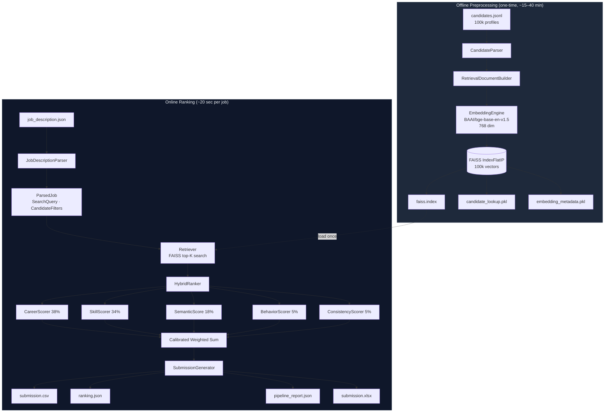
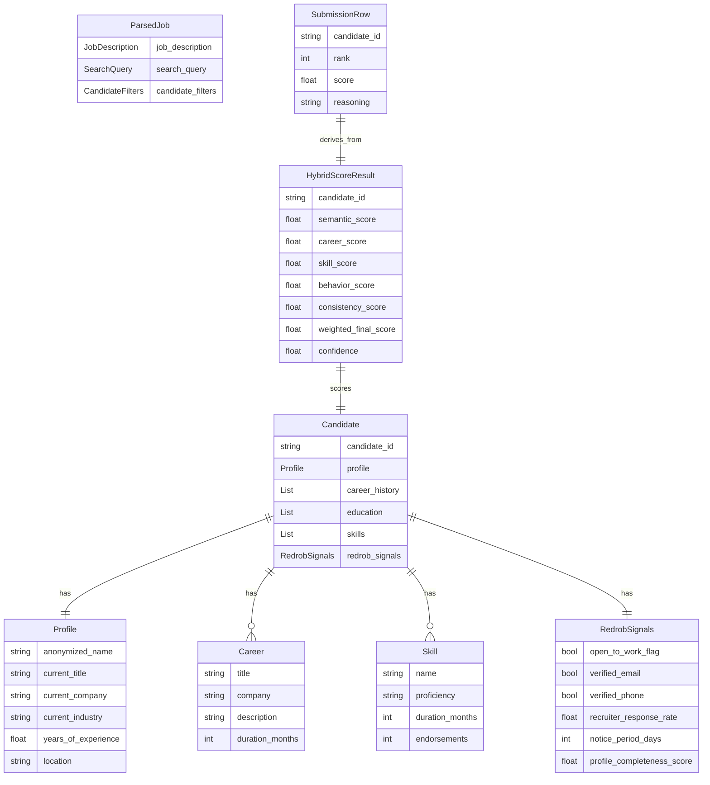

# System Architecture

> RedrobAI · India Runs Data & AI Challenge · Track 1

## High-Level Overview

---

## Component Architecture

```mermaid
classDiagram
    class CandidateParser {
        +parse_many(path) List~Candidate~
        +from_dict(data) Candidate
        +from_jsonl_line(line) Candidate
    }

    class JobDescriptionParser {
        +parse_from_file(path) ParsedJob
    }

    class EmbeddingEngine {
        +model_name: str
        +batch_size: int
        +load_model()
        +embed_documents(docs) ndarray
        +embed_query(text) ndarray
    }

    class Retriever {
        +force_rebuild: bool
        +load_index()
        +build_index(docs)
        +search(query, k) List~Dict~
        +get_index_size() int
    }

    class HybridRanker {
        +career_scorer: CareerScorer
        +skill_scorer: SkillScorer
        +behavior_scorer: BehaviorScorer
        +consistency_scorer: ConsistencyScorer
        +rank_candidates(job, top_k) List~HybridScoreResult~
        +rank_retrieval_results(job, results) List~HybridScoreResult~
        +calculate_hybrid_score(context) HybridScoreResult
    }

    class CareerScorer {
        +score(context) ScoreResult
    }

    class SkillScorer {
        +score(context) ScoreResult
    }

    class BehaviorScorer {
        +score(context) ScoreResult
    }

    class ConsistencyScorer {
        +score(context) ScoreResult
    }

    class SubmissionGenerator {
        +generate_submission(...) Dict
        +build_rows(...) List~SubmissionRow~
    }

    class SubmissionValidator {
        +validate_rows(rows) List~str~
        +validate_csv_file(path) List~str~
    }

    class ReasonGenerator {
        +generate(candidate, result, job) str
    }

    class XlsxExporter {
        +export(rows, path) Path
    }

    class PipelineValidator {
        +validate() PipelineValidationReport
    }

    HybridRanker --> CareerScorer
    HybridRanker --> SkillScorer
    HybridRanker --> BehaviorScorer
    HybridRanker --> ConsistencyScorer
    HybridRanker --> Retriever
    SubmissionGenerator --> ReasonGenerator
    SubmissionGenerator --> SubmissionValidator
    SubmissionGenerator --> XlsxExporter
```

---

## Data Model

---

## Scorer Weight Distribution

| Scorer | Weight | Primary Signal |
|---|---|---|
| CareerScorer | **38%** | Role title, progression, industry, responsibilities |
| SkillScorer | **34%** | Required/preferred skill match, proficiency, duration |
| SemanticScore | **18%** | FAISS cosine similarity (BGE-Base-EN-v1.5) |
| BehaviorScorer | **5%** | Open-to-work, verified contacts, response rate, notice |
| ConsistencyScorer | **5%** | Profile data integrity and internal consistency |
| EducationScorer | 0% | Wired up; disabled for this challenge configuration |

### Calibration Adjustment

After the weighted sum, a small calibration term (±0.08) is applied based on
the **weaker** of career and skill evidence:

- joint ≥ 0.60 → bonus up to +0.10 (corroborated technical match)  
- joint < 0.40 → penalty up to −0.08 (weak technical fit)  
- otherwise → 0

This prevents a high semantic score from masking a poor technical fit.

---

## Artifact Inventory

| Artifact | Size | Description |
|---|---|---|
| `artifacts/faiss/faiss.index` | ~307 MB | IndexFlatIP — 768-dim L2-normalized vectors |
| `artifacts/faiss/candidate_lookup.pkl` | ~1.8 MB | `Dict[candidate_id, metadata]` |
| `artifacts/faiss/embedding_metadata.pkl` | ~17 MB | Per-vector metadata (title, experience) |
| `outputs/submission.csv` | ~54 KB | Official submission |
| `outputs/submission.xlsx` | varies | Formatted Excel export |
| `outputs/ranking.json` | ~560 KB | Full score breakdown |
| `outputs/pipeline_report.json` | ~57 KB | Timing, weights, top-10 |
