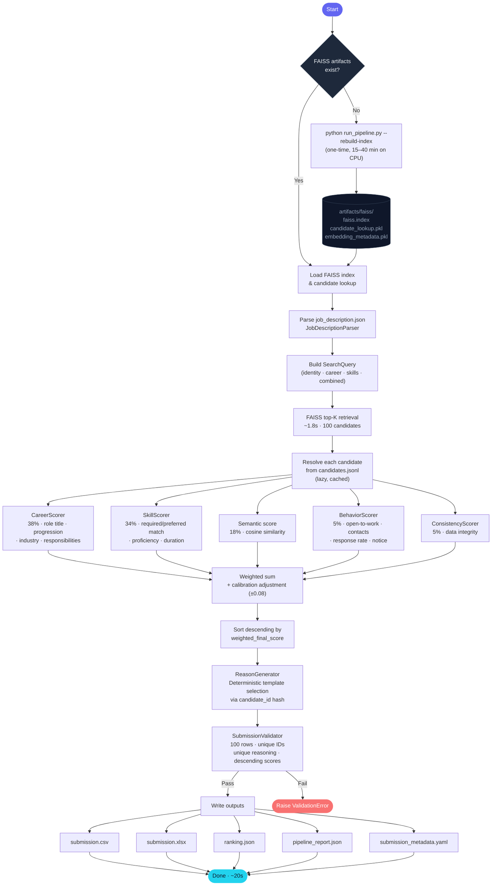
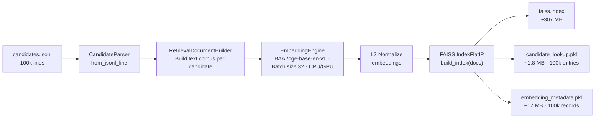
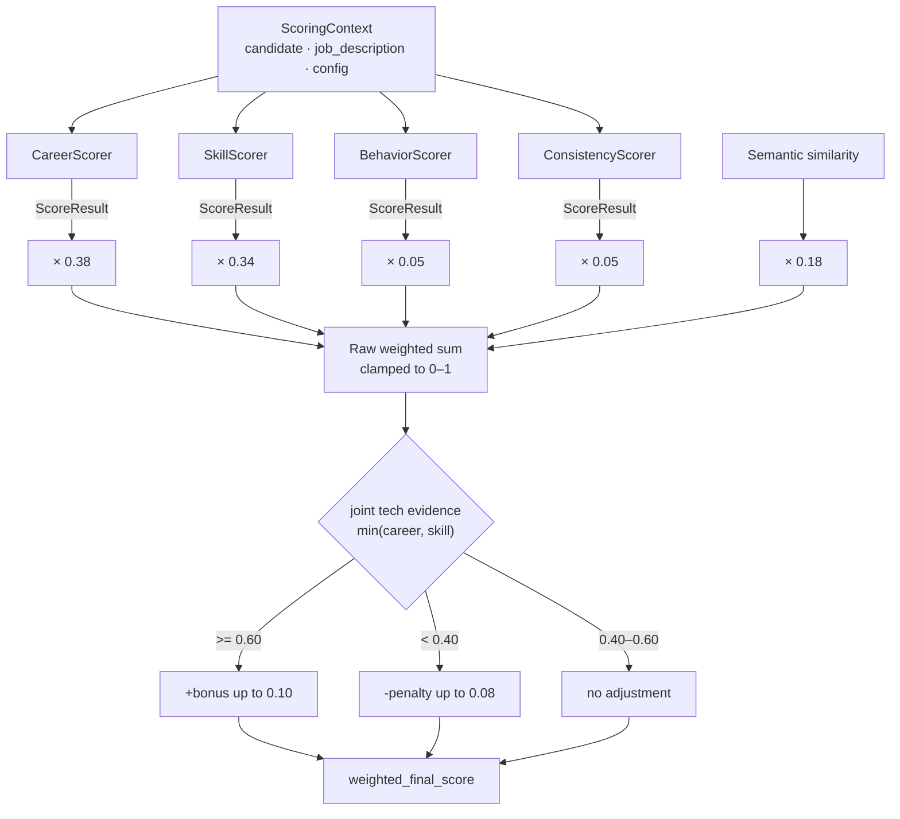
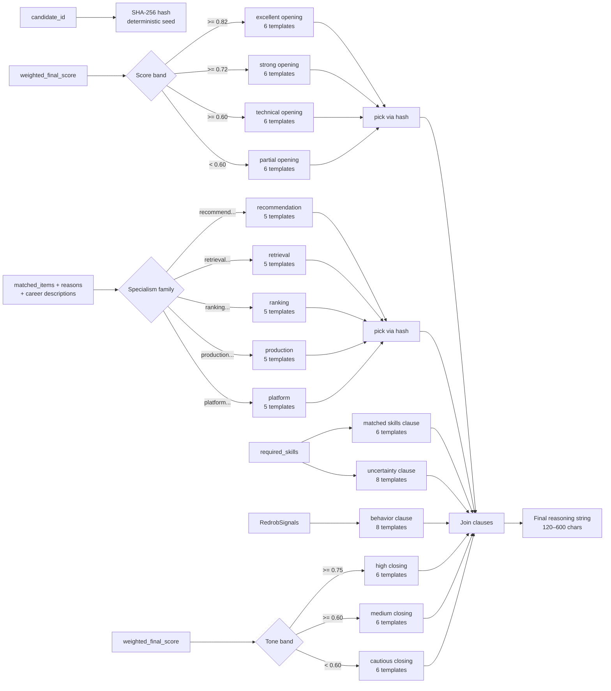
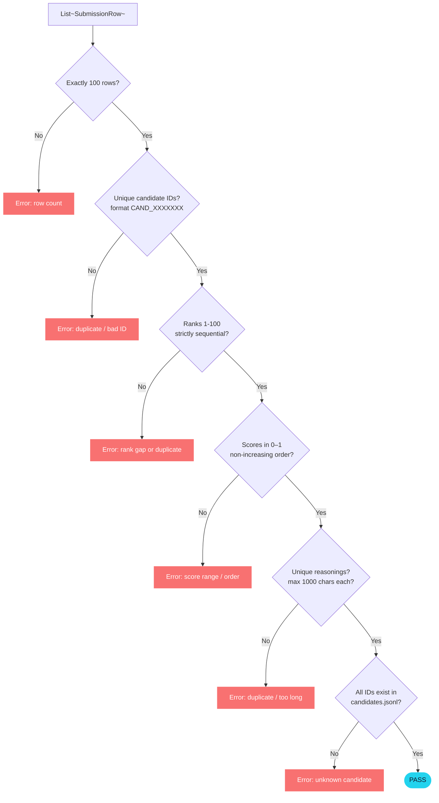

# Pipeline Flow

> RedrobAI · India Runs Data & AI Challenge · Track 1

## End-to-End Pipeline

---

## Offline Indexing Flow

---

## Scoring Stage Detail

---

## ReasonGenerator Logic

---

## Validation Flow

